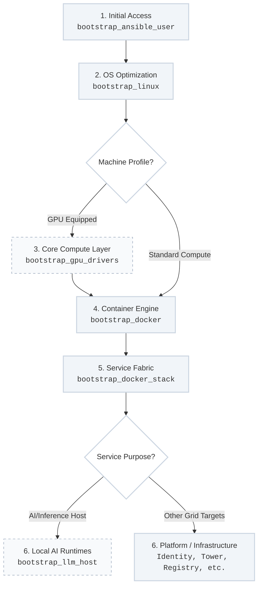

The execution loops managed by `site.yml` rely entirely on a library of specialized, reusable automation roles. To eliminate manual intervention and enforce strict **DRY (Don't Repeat Yourself)** baseline compliance, these roles function as generic state engines that ingest flat variable matrices and translate them into deterministic target node layouts.

---

## Technical Stand-Up Dependency Sequence

Before high-level application or control-plane services are deployed, every host node must progress through a rigid, sequential stand-up pipeline to stabilize credentials, operating system baselines, and execution fabrics:

---

## Step-by-Step Execution Role Blueprint

### 1. Initial Access Authentication (`bootstrap_ansible_user`)
* **Core Purpose:** Injects initial execution profiles, administrative service groups, and SSH public keys.
* **Operational Position:** This is the absolute prerequisite step for new nodes. It establishes secure, key-based authentication paths so downstream automated runs can connect without manual password entries.

### 2. Base Operating System Stabilization (`bootstrap_linux`)
* **Core Purpose:** Shapes raw compute instances into optimized, hardened platforms.
* **Operational Position:** Applies kernel optimizations, configures persistent network interface channel-bonding rules, locks down file permissions, and enforces critical CIS benchmark kernel security profiles.

### 3. Acceleration Layer Integration (`bootstrap_gpu_drivers`)
* **Core Purpose:** Automates the discovery, injection, and stabilization of hardware accelerator software layers.
* **Operational Position:** Executed conditionally *only* on machines equipped with dedicated physical graphics processing units. It installs required kernel modules and toolkit architectures to prepare the bare iron for high-density computing blocks.

### 4. Container Engine Activation (`bootstrap_docker`)
* **Core Purpose:** Establishes the primary containment layer required across the enterprise.
* **Operational Position:** Deploys a stable container runtime engine on the node, locking down system sockets and mapping storage backends (`overlay2`) without introducing floating package dependencies to the host OS.

### 5. Unified Service Stack Architecture (`bootstrap_docker_stack`)
* **Core Purpose:** Evaluates flat variable structures to hydrate platform workloads uniformly.
* **Operational Position:** Handles configuration rendering, runtime port exposures, and mounts **Docker Secrets** safely to container spaces in a reusable, generic implementation across standalone engines or Swarm grids.

### 6. Local AI Inference Infrastructure (`bootstrap_llm_host`)
* **Core Purpose:** Sets up localized, air-gapped machine learning engines and model servers.
* **Operational Position:** Executed conditionally *only* on designated AI infrastructure nodes. It binds containerized model caches and local orchestration endpoints to feed downstream development spaces securely.

---

## Ansible Roles Navigation Tracks

Explore the explicit technical layouts, variable schemas, and verification testing tasks for each underlying playbook tier:

* **[Core System Hardening Roles](/ansible/system-hardening/)** — Deep dives into foundational access mechanics and base OS optimization code (`bootstrap_ansible_user` and `bootstrap_linux`).
* **[Runtime Fabric & Containment Roles](/ansible/runtime-fabric/)** — Technical boundaries governing `bootstrap_docker`, hardware-accelerated `bootstrap_gpu_drivers`, and the generic `bootstrap_docker_stack` engine.
* **[Control-Plane Service Roles](/ansible/control-plane-services/)** — Technical documentation for `bootstrap_llm_host` configurations and inventory-driven domain architecture mapping.
---
