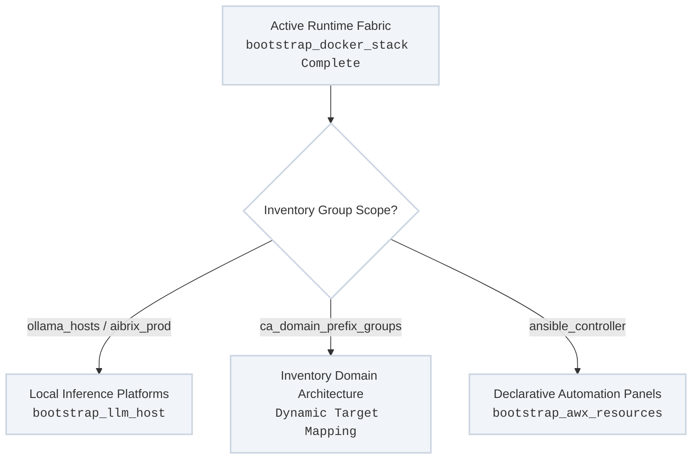

Once a host node is established, accelerated, and encapsulated by the runtime fabric, the platform applies target-specific service definitions. Rather than treating hosts as generic servers, `site.yml` matches specific inventory group scopes—such as AI inference compute clusters, corporate domain definitions, or management gateways—and configures them using dedicated service paths.

---

## Service Track Execution Map

The control-plane service tier parses the node's final group assignment to apply purpose-driven system profiles:



---

## 1. Local AI Inference Infrastructure (`bootstrap_llm_host`)

For air-gapped or localized enterprise machine learning spaces, the platform isolates model runtime loops entirely within your local computing farm.
* **Inventory Targeting:** Injects payloads targeting groups like `aibrix_prod` or `ollama_hosts`.
* **Execution Mechanics:** Manages model weights storage partitioning on local disk arrays, locks down localized HTTP inference sockets, and spins up containerized runtime supervisors (like Ollama or specialized model engines). This setup ensures downstream software tools can consume local models without sending proprietary telemetry data over public internet networks.

---

## 2. Inventory Domain Architecture & Convention Mapping

Domain binding inside the platform completely avoids fragile, standalone infrastructure lookup roles. Instead, system and environment mapping is managed purely through **Inventory Group Conventions**.

Targets are systematically assigned to their authoritative environments using a reverse-order naming schema:
* **The Convention Pattern:** Every domain boundary group uses the prefix `ca_domain_` followed by the target domain name mapped in **reverse order with underscores replacing dots**.
* **Mapping Realization:** When a machine is declared under a specific environment, it is written directly into its corresponding group map inside `inventory/{environment}/hosts.yml`. Downstream templates and shared execution tasks evaluate these parent memberships to dynamically configure localized resolver strings, trust structures, and system contexts.

### Domain Group Examples:
* **Domain Target:** `dettonville.int` → **Inventory Group:** `ca_domain_int_dettonville`
* **Domain Target:** `johnson.int` → **Inventory Group:** `ca_domain_int_johnson`

---

## 3. Automated Controller Resource Injection (`bootstrap_awx_resources`)

To maintain complete Configuration-as-Code control over your central execution management panels, the framework prevents administrators from configuring platform rules via the user interface.
* **Inventory Targeting:** Binds directly to the `ansible_controller` master instance profiles (e.g., `control_host`).
* **Keyless API Integration:** Leverages short-lived administrative tokens to programmatically register organization footprints, link version-controlled infrastructure repositories, and instantiate job templates mapped directly to your production tag lines.

---

## Production Variable Matrix Examples

This profile shows how individual machine types map their designated group attributes to configure downstream target layers via your service variables:

```yaml
# Inside inventory/group_vars/aibrix_prod.yml (Local LLM Compute Grid)
bootstrap_linux__setup_gpu_drivers: true
bootstrap_linux__setup_docker: true

# LLM Node Parameters
llm_host_engine: "ollama"
llm_host_models:
  - name: "llama3:8b"
    state: "present"
  - name: "codegemma"
    state: "present"
llm_host_storage_backend: "/var/data/models"

---
# Inside inventory/prod/hosts.yml (Enforcing the Naming Convention)
ca_domain_int_dettonville:
  hosts:
    vm-template-01.dettonville.int:
    inference-grid-01.dettonville.int:
    control-panel.dettonville.int:
  vars:
    domain_environment_type: "production"
    local_pki_realm: "dettonville_root"
```

---

## Recommended Target Management Loops

### Force Synchronize AI Model Registries and Caches Idempotently
```bash
ansible-playbook -i inventory/hosts site.yml --tags "bootstrap-llm-host" --limit "aibrix"
```

### Validate Inventory Group Hierarchies and Domain Mappings
```bash
ansible-inventory -i inventory/prod/hosts.yml --graph
```
---
