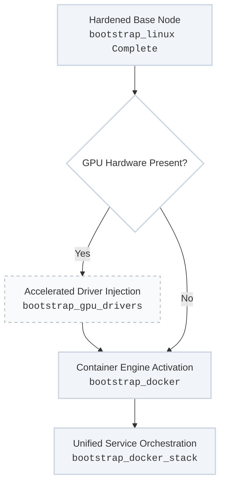

Once the underlying operating system is fully stabilized and hardened by the foundational bootstrap phase, the platform provisions its active execution fabric. By isolating all downstream workloads inside standard container spaces, the system ensures zero package drift on the host nodes while supporting high-density compute and accelerated local AI processing.

---

## Execution Fabric Stand-Up Flow

The runtime fabric roles transition a bare operating system node into an active container cluster or accelerated hardware endpoint:



---

## 1. Acceleration Layer Integration (`bootstrap_gpu_drivers`)

For specialized machine learning pipelines, compute nodes require explicit hardware acceleration access. The `bootstrap_gpu_drivers` role automates this complex setup layer conditionally.
* **Conditional Triggering:** It hooks directly into the master `bootstrap_linux` run-loop but only executes when target hardware attributes indicate a compatible graphics processing unit is active (`bootstrap_linux__setup_gpu_drivers: true`).
* **Execution Mechanics:** Programmatically blacklists conflicting open-source graphics modules, loads specific kernel modules, pins corporate repository targets for official toolkit binaries, and configures localized validation hooks to confirm hardware passthrough states are operational.

---

## 2. Container Engine Isolation (`bootstrap_docker`)

The `bootstrap_docker` role provisions the definitive runtime environment for all platform applications and runners. By encapsulating workloads inside container namespaces, host OS requirements are kept minimal.
* **Host Guardrails:** Restricts the host node dependencies to the container daemon and basic runtime utilities.
* **Storage Optimization:** Standardizes the storage layout to use the high-performance `overlay2` storage driver, sets explicit logging max-sizes to prevent local disk exhaustion, and locks down the local Docker daemon socket interface to adhere to strict security profiles.

---

## 3. Reusable Stack Orchestration (`bootstrap_docker_stack`)

Instead of maintaining a massive footprint of fragmented, single-purpose roles to deploy varying applications, the platform handles all containerized workloads using a singular, heavily abstracted orchestration engine: **`bootstrap_docker_stack`**.

This role enforces your strict **DRY (Don't Repeat Yourself)** blueprint by mapping flat configuration variable arrays into functional service states across both standalone engines and distributed Docker Swarm grids:

* **Dynamic Templating loops:** Iterates through a flat variable data matrix to dynamically push localized configurations, drop proxy profiles, mount data persistence directories, and map runtime network ports.
* **Secure Credential Injection:** Programmatically reads AES-256 encrypted variables directly from **Ansible Vault** schemas and maps them onto the host node as active **Docker Secrets** containers can consume via secure memory-mount paths (`/run/secrets/`), preventing cleartext strings from ever being written to physical host disks.

---

## Comprehensive Variable Definition Schema

This structural data profile illustrates how the generic runtime fabric is parameterized inside your inventory tables to selectively provision accelerated spaces or standard runner nodes:

```yaml
# Inside inventory/group_vars/ai_inference_compute.yml
# 1. Acceleration Tier Toggle
bootstrap_linux__setup_gpu_drivers: true
bootstrap_linux__setup_docker: true

# 2. Reusable Stack Mapping Block
docker_stack_name: "inference-grid"
docker_stack_type: "standalone"

docker_stack_secrets:
  - secret_name: "model-api-token"
    secret_value: "{{ vault_inference_api_token }}" # Securely parsed from Ansible Vault

docker_stack_services:
  - service_name: "ollama-inference-engine"
    image: "ollama/ollama:latest"
    replicas: 1
    volumes:
      - "/var/data/models:/root/.ollama"
    environment:
      - "OLLAMA_NUM_PARALLEL=4"
    secrets:
      - "model-api-token"
    # Mapping specialized GPU hardware resources to the container environment
    deploy_resources:
      reservations:
        devices:
          - driver: "nvidia"
            count: "all"
            capabilities: ["gpu"]
```

---

## Recommended Operational Control Vectors

### Provision and Enable Container Runtimes Across the Farm
```bash
ansible-playbook -i inventory/hosts site.yml --tags "bootstrap-docker"
```

### Force Synchronize the Docker Stack Configurations and Injected Secrets
```bash
ansible-playbook -i inventory/hosts site.yml --tags "bootstrap-docker-stack" --limit "ai_compute" --ask-vault-pass
```
---
