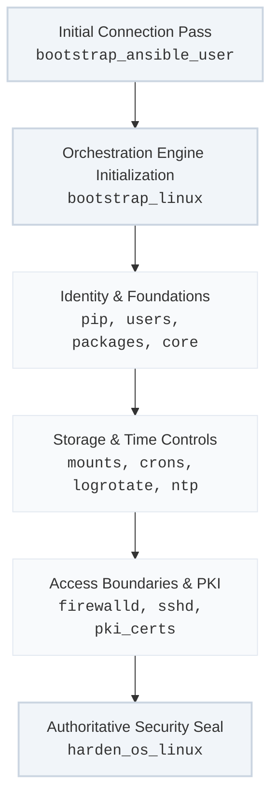

The baseline security of the entire datacenter depends on the initial stabilization pass applied to the underlying operating system. The platform handles this through two critical automation components: a dedicated initial access role (`bootstrap_ansible_user`) and a multi-tier orchestration role (`bootstrap_linux`) that executes modular configuration steps before invoking our authoritative security standard (`harden_os_linux`).

---

## Technical Stand-Up Pipeline

The execution sequence within the system hardening track transitions a newly provisioned, untrusted OS footprint into a fully managed, locked-down node:



---

## 1. Initial Access Stabilization (`bootstrap_ansible_user`)

Before any generic configuration or hardening tasks can run, the automation engine must establish a reliable, non-interactive secure connection path to the target node.
* **Mechanics:** Injects the dedicated administration user profile, maps secondary management groups, and registers your team's authorized public SSH keys into the target user's `authorized_keys` configuration.
* **Precedence Rule:** This role runs as an absolute prerequisite. Once active, all subsequent playbook loops leverage this secure key-based path, eliminating interactive passwords or temporary credentials from the execution environment.

---

## 2. Modular System Orchestration (`bootstrap_linux`)

The `bootstrap_linux` role serves as an abstract orchestration engine. Rather than containing static monolithic scripts, it functions as a master supervisor that sequences downstream, specialized roles. This modular layout allows operators to toggle specific system features on or off dynamically using boolean parameters in their variable files.

The execution layout processes the environment through a structured task list:

### Phase A: Foundational Environment & Run-Times
* **`bootstrap_pip`:** Configures localized, isolated Python pip environments using explicit versioned interpreters to isolate automation tasks from the system's stock Python packages.
* **`bootstrap_linux_user`:** Provisions supplemental functional application user groups and permission profiles uniformly across the node matrix.
* **`bootstrap_linux_package`:** Hydrates core system utility binaries from localized mirror networks while bypassing public external repositories.
* **`bootstrap_linux_core` & `bootstrap_linux_mount`:** Configures hostname resolutions, global environment layouts, persistent journald logging policies, and mounts local multi-tiered storage disks with optimized access flags.

### Phase B: Local Network Controls & System Services
* **`bootstrap_logrotate` & `bootstrap_ntp`:** Establishes deterministic log lifecycle limits and configures high-precision time synchronization with authoritative internal NTP stratum clocks.
* **`bootstrap_linux_firewalld` & `bootstrap_sshd`:** Standardizes local firewall zoning rules, purges unsafe network protocols, disables root SSH login vectors, and enforces key-only SSH handshakes.
* **`deploy_pki_certs`:** Installs and registers internal corporate root and intermediate certificates into the system's central cryptographic trust stores.

---

## 3. Authoritative Security Seal (`harden_os_linux`)

Once the underlying infrastructure components and local operational services are hydrated, the `bootstrap_linux` orchestration pipeline seals the target host by invoking **`harden_os_linux`**.

* **Role Mechanics:** This role enforces your authoritative security baseline, mapping Center for Internet Security (CIS) benchmarks and rigorous enterprise compliance profiles directly to the node.
* **Idempotent Hardening:** It sweeps the operating system configuration files—including PAM authorization matrices, system limits, kernel runtime parameters, and file mask settings (`umask 027`)—to idempotently align the target node with the declared security posture. If any rogue change or drift is detected, it rewrites the configuration on the fly to preserve system integrity.

---

## Parameterized Control Matrix

The entire operational workflow is managed via declarative flags inside your inventory variables, allowing you to easily adjust host features based on their final purpose:

```yaml
# Inside inventory/group_vars/all.yml
bootstrap_linux__os_python_interpreter: "/usr/bin/python3"
bootstrap_linux__install_packages: true
bootstrap_linux__setup_crons: true
bootstrap_linux__setup_logrotate: true
bootstrap_linux__install_ntp: true
bootstrap_linux__setup_firewalld: true
bootstrap_linux__setup_sshd: true
bootstrap_linux__deploy_pki_certs: true

# Security hard-lock toggle
bootstrap_linux__harden: true

# Conditional service exclusions (enabled only for targeted groups)
bootstrap_linux__setup_gpu_drivers: false
bootstrap_linux__setup_docker: false
```

---

## Recommended Execution Control Loops

### Execute Full System Hardening and Hydration Against a Group
```bash
ansible-playbook -i inventory/hosts site.yml --tags "bootstrap-linux" --limit "database_nodes"
```

### Validate SSH Configurations and Local Security Hardening States Without Churn
```bash
ansible-playbook -i inventory/hosts site.yml --tags "bootstrap-sshd,harden_os_linux" --check
```
---
