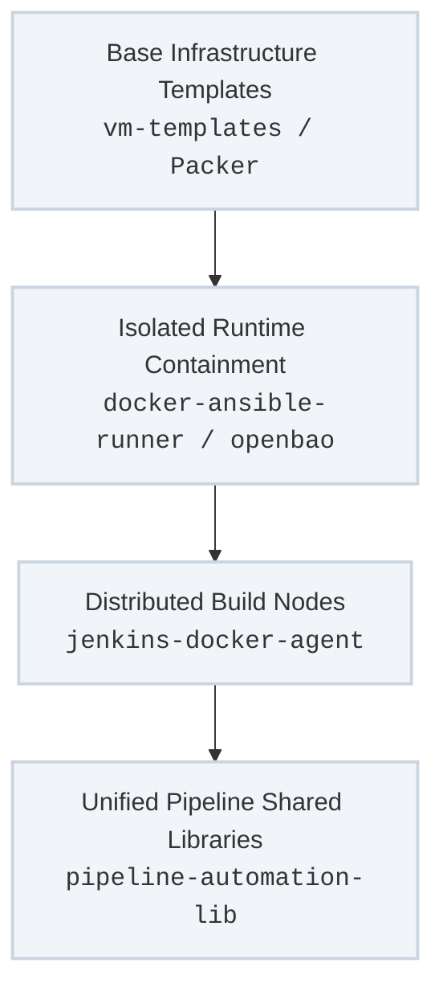

The infrastructure orchestration driven by `site.yml` does not operate in a vacuum. To maintain absolute custody over the execution environment inside private perimeters, the platform relies on a tightly coupled ecosystem of supporting software repositories.

These repositories formalize the delivery of containerized automation runners, secure secret boundaries, shared pipeline logic, and golden virtual machine images.

---

## Supply-Chain Architecture Layout

The supporting suite decouples the runtime automation layers from the host system, moving from foundational images up to active declarative pipelines:

---

## Ecosystem Repository Breakdown

### 1. Unified Shared Pipeline Foundations (`pipeline-automation-lib`)
* **Purpose:** The authoritative Jenkins core shared Groovy library used to handle infrastructure job automation.
* **Control-Plane Practice:** The Jenkins controller itself is constructed entirely via **Configuration-as-Code (JCasC)** parameters. It acts as a prime example of a "keyless" control-plane setup, where authentication hooks and runner configurations are programmatically bound at initialization, avoiding manually configured credentials or click-ops mutations.

### 2. Standardized Compute Hardening Templates (`vm-templates`)
* **Purpose:** The structural blueprint for building physical and virtual compute instances.
* **Execution Mechanics:** Contains complete HashiCorp Packer build configurations and automation scripts for generating standardized, hardened, and reproducible virtual machine templates across multi-OS matrices (Ubuntu, RHEL, CentOS, Debian, and Windows) for VMware vSphere arrays. These images pre-bake the core `bootstrap_linux` attributes before the templates enter the active distribution pool.

### 3. Layered Automation Workers (`jenkins-docker-agent`)
* **Purpose:** An enterprise-grade collection of optimized, purpose-built Docker build agent configurations designed to scale a distributed Jenkins execution grid.
* **Design Pattern:** Organized into decoupled execution layers:
  * **Base Utilities Layer:** Provides lightweight system commands and core operational tools.
  * **Specialized Downstream Runtimes:** Injects isolated runtime matrices, testing harnesses, and automated documentation compilation pipelines, ensuring the target controller host remains free from floating dependency pollution.

### 4. Hermetic Orchestration Runtimes (`docker-ansible-runner`)
* **Purpose:** Provides a completely reproducible, containerized execution bubble for the main Ansible engine.
* **Deterministic Guardrails:** Pre-loads specific python environments and explicit versioned Ansible Galaxy collections. This ensures that when `site.yml` executes, it uses identical code versions whether running from a local developer terminal or an automated Jenkins agent pool.

### 5. Secure Identity & Storage Vaults (`docker-openbao-ansible`)
* **Purpose:** Extends the open-source community `openbao/openbao` ecosystem to deliver a secure, self-contained secrets boundary.
* **Automation Mechanism:** Orchestrates the automatic initialization, operational configuration, and secure unsealing of local OpenBao server instances. It leverages **Ansible Vault** loops to encrypt the highly sensitive initialization keys at rest, keeping your credentials secure without relying on cloud-based key management stores.

---

## Operational Workflow Integration

When an infrastructure update or a virtual machine scaling event is triggered, these repositories execute sequentially as a unified delivery pipeline:

1. **Image Compilation:** `vm-templates` runs via automated triggers to bake the latest OS package baselines into a vSphere golden image.
2. **Runtime Initialization:** A Jenkins job loads `pipeline-automation-lib` to interpret the task request, instantly spawning a secure execution bubble via `jenkins-docker-agent` and `docker-ansible-runner`.
3. **Secure Unsealing:** The runner reaches into the automated `docker-openbao-ansible` boundary to gather necessary execution parameters using encrypted handshakes.
4. **Site Realization:** The system runs `site.yml` using the designated tags, modifying target infrastructure nodes while maintaining complete environmental predictability.

---

## Subsystem Navigation Tracks

Explore the specific technical documentation and code standards for each underlying ecosystem track:

* **[Declarative Jenkins Infrastructure](/ecosystem/jenkins-infrastructure/)** — Keyless JCasC controller definitions, OIDC authentication setups, and global shared library execution structures.
* **[Machine Image Delivery & Containment](/ecosystem/image-containment/)** — Packer templates for vSphere, layered build agent topologies, and hermetic Ansible execution images.
* **[Secure Secrets Boundaries](/ecosystem/secrets/)** — Automated local OpenBao server initialization and Ansible Vault initialization loop patterns.
---
