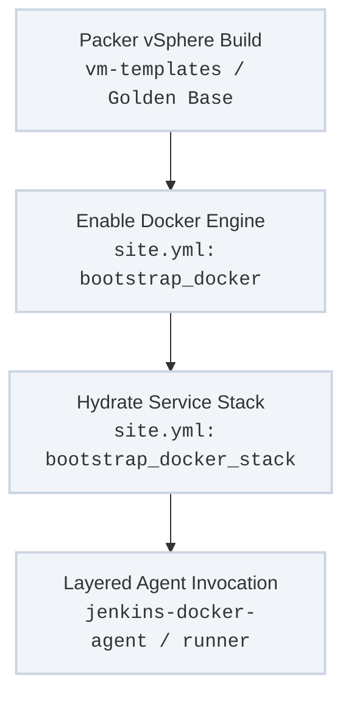

The platform enforces absolute isolation across the execution grid. By decoupling execution tools from the host operating system, target nodes require no pre-installed development packages, language runtimes, or custom binaries.

Instead, a target node simply needs a standardized, hardened container runtime base. All pipeline jobs, testing loops, and orchestration scripts run inside purpose-built, disposable container environments.

---

## The Host Bootstrapping & Containment Pipeline

The transition from a raw compute template to an active, containerized execution worker follows a strict, repeatable path:



---

## Core Roles & DRY Implementation Patterns

### 1. Minimalist Host Activation (`bootstrap_docker`)
* **Target Playbook Hook:** `site.yml` -> `--tags bootstrap-docker`
* **Execution Mechanics:** Installs and stabilizes upstream open-source container engines directly on bare-metal nodes or virtual machines. It locks down the local storage engine configuration (`overlay2`) and secures local container sockets. This establishes the absolute maximum requirements permitted on a host node.

### 2. The Heavy Lifting Service Architecture (`bootstrap_docker_stack`)
* **Target Playbook Hook:** `site.yml` -> `--tags bootstrap-docker-stack`
* **DRY Implementation Paradigm:** Instead of writing unique, fragmented roles to spin up distinct application services, this singular, highly abstract role handles structural hydration for all docker services across the enterprise (whether running on standalone engines or full Docker Swarm topologies).
    * **Dynamic Templating:** The role evaluates simple group asset definitions to programmatically drop localized configuration templates, service files, and proxy paths.
    * **Secure Credential Injection:** Manages the generation, mapping, and mount-injection of **Docker Secrets** and encrypted environment variables. It maps keys securely to container runtimes without exposing passwords in plain-text or caching keys on host filesystems.

---

## Supporting Ecosystem Repositories

### 1. Hardened Infrastructure Bases (`vm-templates`)
* **Repository Target:** `github.com/lj020326/vm-templates`
* **Role in Pipeline:** Contains complete HashiCorp Packer configuration matrices for building reproducible, audited, and secured virtual machine templates across multiple operating systems (Ubuntu, RHEL, CentOS, Debian, and Windows) for VMware vSphere.
* **Design Rule:** These templates pre-configure initial OS parameters and standard administrative access pathways, ensuring every virtual compute instance joins the network with a predictable baseline before Docker layers are ever introduced.

### 2. Layered Execution Environments (`jenkins-docker-agent`)
* **Repository Target:** `github.com/lj020326/jenkins-docker-agent`
* **Role in Pipeline:** Provides an enterprise collection of purpose-built, distributed build worker configurations. It prevents floating dependency pollution on the Jenkins controller by splitting workers into strict execution layers:
    * **Base Utilities Layer:** Contains core system binaries, diagnostic commands, and generic shell assets.
    * **Specialized Downstream Runtimes:** Adds isolated testing harnesses, multi-version compilation toolkits, and text/documentation compilers.

### 3. The Sealed Orchestration Runner (`docker-ansible-runner`)
* **Repository Target:** `github.com/lj020326/docker-ansible-runner`
* **Role in Pipeline:** Packs the core Ansible orchestration engine into a hermetic container bubble. It comes pre-loaded with locked Python dependency environments and versioned Ansible Galaxy collections. When the shared pipeline engine triggers `site.yml`, it executes within this wrapper, ensuring identical results whether run from an operator's workstation or a remote automated agent.

---

## Example Declarative Stack Definition

This configuration block shows how the generic `bootstrap_docker_stack` role parses a unified variable matrix to stand up an execution runner cluster with secure credentials, completely eliminating manual setup steps:

```yaml
# Inside inventory/group_vars/automation_runners.yml
docker_stack_name: "jenkins-agent-grid"
docker_stack_type: "swarm"  # Options: standalone | swarm

docker_stack_secrets:
  - secret_name: "jenkins-agent-secret"
    secret_value: "{{ vault_jenkins_agent_token }}"
    secret_type: "text"

docker_stack_services:
  - service_name: "ansible-worker-node"
    image: "lj020326/jenkins-docker-agent:latest"
    replicas: 4
    volumes:
      - "/var/run/docker.sock:/var/run/docker.sock"
    environment:
      - "JENKINS_URL=[https://jenkins.local.dettonville.cloud](https://jenkins.local.dettonville.cloud)"
    secrets:
      - "jenkins-agent-secret"
```

---

## Operational Execution Tracks

### Force-Synchronize the Jenkins Docker Stack Configuration
```bash
ansible-playbook -i inventory/hosts site.yml \
  --tags "bootstrap-docker,bootstrap-docker-stack" \
  --limit "runner_hosts"
```

### List Tasks Governing Container Layer Setup Without Mutating Hosts
```bash
ansible-playbook -i inventory/hosts site.yml \
  --tags "bootstrap-docker-stack" \
  --list-tasks
```
---
