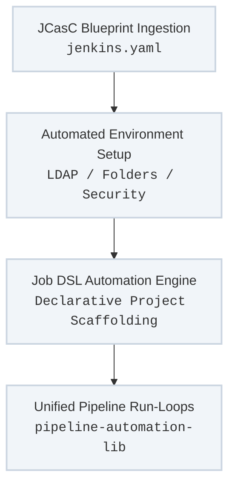

The central automation engine behind the platform eliminates manual controller configuration, ephemeral GUI tweaks, and error-prone "click-ops" management. By enforcing a **keyless operator model**—where no administrator ever types configuration details or builds jobs inside an interactive user interface—the entire platform stays aligned, consistent, and easily reconstructed straight from source code.

---

## Operator-Free Control Plane Architecture

The initialization sequence transitions raw configuration blueprints into fully dynamic execution runners without human keyboard intervention:



---

## Architectural Pillars of the Automated Controller

### 1. Zero-Touch Configuration-as-Code (JCasC)
Instead of relying on human memory or documentation steps to configure a controller, the exact system state is written into a standard text schema (`jenkins.yaml`). At boot time, the JCasC plugin reads this manifest and provisions the environment automatically.
* **No Fat-Fingered Entry:** Critical parameters—such as LDAP directory search paths, system user permissions, global environment variables, and tool locations—are pre-defined. This eliminates typos, mismatched syntax, and security discrepancies.
* **Strict Drift Suppression:** Any configuration changes made directly in the GUI by an administrator are non-persistent. Restarting the controller container instantly wipes out manual modifications and restores the system to the authoritative git-versioned blueprint.

### 2. Programmatic Job & Folder Scaffolding (Job DSL)
Operators do not create items, configure folders, or design pipeline jobs inside the browser interface. The platform leverages the Jenkins Job DSL engine to programmatically construct the workspace.
* **Bulk Layout Definitions:** The system reads flat configuration files or loops through designated code trees to auto-generate folders, access groups, and multi-branch pipelines.
* **Perfect Alignment:** This guarantees that your testing, deployment, and maintenance jobs are named, mapped, and structured uniformly across your staging and production environments.

### 3. Centralized Execution Logic (`pipeline-automation-lib`)
To keep Jenkinsfiles across your repositories as clean as possible, all heavy execution code blocks, helper utilities, and Ansible runner wrappers are extracted into a central, version-controlled shared library.
* **Generic Entrypoints:** Individual projects don't write custom script blocks; they simply invoke high-level keywords provided by `pipeline-automation-lib`.
* **Playbook Integration:** The library handles the precise syntax for spawning containerized runner environments, injecting parameters, and parsing your `site.yml` targets based on explicit tag matrices.

---

## Technical Configuration Blueprint

This example block illustrates how your core system properties, directory access bindings, and initial seeding tasks are fully defined in code, completely eliminating manual setup steps:

```yaml
jenkins:
  systemMessage: "Automated Datacenter Controller - State Managed via Configuration as Code."
  securityRealm:
    ldap:
      server: "ldaps://directory.local.dettonville.cloud:636"
      rootDN: "dc=dettonville,dc=cloud"
      userSearchFilter: "(uid={0})"
      groupSearchFilter: "(member={0})"
  authorizationStrategy:
    projectMatrix:
      permissions:
        - "Overall/Read:authenticated"
        - "Overall/Administer:jenkins-admin-group"

unclassified:
  globalLibraries:
    libraries:
      - name: "pipeline-automation-lib"
        defaultVersion: "main"
        retriever:
          modernSCM:
            scm:
              github:
                repoOwner: "lj020326"
                repository: "pipeline-automation-lib"
                credentialsId: "infra-github-token"

jobs:
  - script: >
      folder('Datacenter-Lifecycle') {
        description('Automated datacenter provisioning and maintenance pipelines.')
      }
```

---

## Keyless Setup Initialization Pass

When a new Jenkins environment spins up, it processes these text assets through a predictable lifecycle loop:

1. **Manifest Load:** The engine boots and evaluates `jenkins.yaml`, instantly spinning up system parameters and binding LDAP access hooks.
2. **Global Library Registration:** The controller mounts `pipeline-automation-lib` as an authoritative script provider for downstream pipelines.
3. **Automated Job Scaffolding:** The Job DSL parser sweeps your declarative configurations, building folders, projects, and webhooks with zero human entry.
4. **Deterministic Readiness:** The controller shifts to an active status, ready to safely parse `site.yml` plays across your server groups.
---
