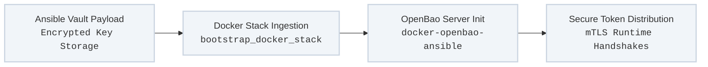

Operating a secure automation platform within private, air-gapped, or highly regulated perimeters requires moving away from clear-text configuration files and external public cloud credential managers.

The platform addresses this by establishing an immutable, localized secrets perimeter. By wrapping an open-source **OpenBao** server architecture inside our standardized, tag-driven container orchestration layer, sensitive tokens are fully encrypted at rest and safely injected into active service containers at runtime.

---

## Secure Secrets Processing Loop

The cryptographic lifecycle transitions unconfigured container clusters into highly secure, automatically unsealed credential systems:



---

## Core Technologies & Execution Mechanics

### 1. Cryptographic Ingestion (`docker-openbao-ansible`)
* **Repository Target:** `github.com/lj020326/docker-openbao-ansible`
* **Architectural Purpose:** Extends the official open-source community `openbao/openbao` ecosystem to supply a dedicated secrets container image.
* **Automated Setup:** This image packages the baseline logic necessary to programmatically handle server initialization, storage backend partitioning, and configuration generation without requiring an operator to interact manually with a command-line utility or browser interface.

### 2. Dual-Layer Encryption (Ansible Vault + Docker Secrets)
To achieve complete automation without human data entry, the system eliminates interactive, manual unsealing workflows by nesting credentials securely across separate automation layers:
* **At-Rest Storage (Ansible Vault):** The master OpenBao root keys and unseal tokens are stored inside your git repository as strongly encrypted flat-file variables using AES-256 standard `ansible-vault` blocks.
* **In-Flight Transport (Docker Secrets):** During execution, the playbook decrypts the variable payload in memory and passes it directly to the host node using the generic `bootstrap_docker_stack` role. The framework writes these parameters into secure, volatile memory mount points (`/run/secrets/`) inside the container namespace, ensuring the keys are never written to host filesystems in the clear.

### 3. Keyless Runtime Access & Local PKI Integration
Once the OpenBao cluster is initialized and unsealed by the automation engine, it integrates seamlessly into the local network control plane:
* **Mutual TLS (mTLS):** All administrative API communication with OpenBao requires certificate verification managed by the core `bootstrap_ca_certs` track.
* **Transient Application Tokens:** Downstream application workloads and Jenkins orchestration nodes fetch short-lived, transient read tokens on demand. This approach avoids baking static passwords or long-lived keys directly into application code bases or persistent data disks.

---

## Declarative Secrets Mapping Schema

This configuration profile illustrates how the generic `bootstrap_docker_stack` variables are used to securely initialize, map, and expose the encrypted OpenBao platform structures without writing custom, non-standard automation tasks:

```yaml
# Inside inventory/group_vars/security_nodes.yml
docker_stack_name: "security-perimeter"
docker_stack_type: "standalone"

docker_stack_secrets:
  - secret_name: "openbao-unseal-key-1"
    secret_value: "{{ vault_openbao_key_1 }}" # Securely decrypted from Ansible Vault
    secret_type: "text"
  - secret_name: "openbao-admin-password"
    secret_value: "{{ vault_openbao_root_password }}"
    secret_type: "text"

docker_stack_services:
  - service_name: "openbao-server"
    image: "lj020326/docker-openbao-ansible:latest"
    ports:
      - "8200:8200"
    volumes:
      - "/var/data/openbao:/openbao/data"
    secrets:
      - "openbao-unseal-key-1"
      - "openbao-admin-password"
    environment:
      - "BAO_LOCAL_CONFIG_PATH=/openbao/config/config.hcl"
      - "AUTO_UNSEAL_ENABLED=true"
```

---

## Operational Enforcement Actions

### Deploy and Unseal the OpenBao Secure Perimeter Stack
```bash
ansible-playbook -i inventory/hosts site.yml \
  --tags "bootstrap-docker-stack" \
  --limit "security_hosts" \
  --ask-vault-pass
```

### Validate OpenBao Cluster Status and Certificates Locally
```bash
ansible-playbook -i inventory/hosts site.yml \
  --tags "bootstrap-docker-stack" \
  --list-tasks
```
---
