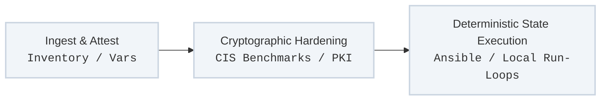

The **Dettonville Automation Framework** is a systematic approach to infrastructure orchestration, designed specifically for enterprise environments operating under strict regulatory bounds, air-gapped isolation, or complex private network topologies.

Unlike public-cloud-centric tooling that relies heavily on ephemeral endpoints and continuous external package mirror availability, Dettonville treats local infrastructure state as a deterministic software compilation target, prioritizing complete custody over the execution environment.

---

## Core Framework Pillars

### 1. Air-Gap Native Design
The framework assumes absolute isolation. Every module, role, configuration matrix, and verification payload is packaged to execute locally.
* **Zero Runtime Downloads:** No dynamic polling of public repositories (`pip`, `galaxy`, `rubygems`, or `npm`) during execution pipelines.
* **Hermetic Execution:** All software supply chain dependencies are cryptographically signed, cached, and validated inside your local perimeter.

### 2. Immutable Configuration Over Drift
Instead of traditional configuration management that merely corrects drift on an active node, the Dettonville framework enforces structural enforcement:
* **Declarative Hardening:** Hardening benchmarks (such as CIS profiles) are natively baked into core systemic roles, preventing compliance drift before it happens.
* **Idempotent Attestation:** Execution tasks utilize local state attestation layers to guarantee zero execution noise on active clusters.

### 3. Systematic DRY Realization (Don't Repeat Yourself)
The foundational premise of all code and layout design within the ecosystem is strict elimination of repetition to the extent of reason. Redundant tasks, duplicated variable blocks, and copied role plays are rejected as anti-patterns. Immutability requires that structural definitions exist in exactly one authoritative location, reducing maintenance overhead and preventing structural variance.

### 4. Control-Plane Configuration-as-Code (CaC)
Critical domain fixtures—such as local PKI roots, core DNS routing hierarchies, and local package/container registries—are anchored strictly via versioned text files. Downstream application runtimes remain entirely deterministic because their foundational control planes are driven by code rather than manual adjustments or dynamic state engines.

### 5. Open-Source Flat-File Durability
The ecosystem is highly opinionated, rejecting vendor lock-in and proprietary binary databases. All vital configuration state, inventory topologies, and platform parameters are stored exclusively in widely accepted, human-readable schemas (YAML, JSON, CSV, Markdown), guaranteeing that the entire infrastructure blueprint can be audited or recovered using standard UNIX text utilities.

---

## Technical Architecture Flow

The framework handles system lifecycle automation across three distinct operational boundaries:

1. **Ingest & Attest:** Evaluates target system baseline profiles, local facts, and cryptographic token states without mutating the operating system.
2. **Cryptographic Hardening:** Applies localized target properties, local root certificate logic, and enterprise security policies.
3. **Deterministic State Execution:** Invokes standard local run-loops to apply configurations completely detached from outside internet telemetry.

---

## Framework Architecture Tracks

Navigate through the foundational engineering specifications that govern the platform:

* **[Platform Architecture Guidelines](/framework/architecture/)** — Formalizing Configuration-as-Code patterns for critical control-plane fixtures and deterministic application runtimes.
* **[Programmatic Inventory Lifecycle](/framework/inventory-lifecycle/)** — Managing automated host provisioning, API-driven controller triggers, and Git-backed inventory mutations via the git_inventory framework.
* **[Local Hardening Standards](/framework/security/)** — Enforcing CIS compliance baselines, automated local certificate minting, and supply-chain verification.
* **[Automation Engineering Standards](/framework/automation/)** — Operational execution rules, community-edition tool selection, flat-file schema constraints, and parameterized DRY design guidelines.

---
