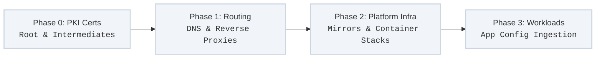

To achieve deterministic and immutable runtime states across an entire organizational domain, the underlying infrastructure must eliminate manual adjustments, ephemeral staging, and environmental drift.

The Dettonville framework enforces this by applying rigorous **Configuration-as-Code (CaC)** principles directly to the **Control-Plane Fixtures** that anchor the domain before application layers are ever introduced.

---

## The Immutable Control-Plane Foundation

In an air-gapped or corporate datacenter environment, applications cannot rely on external, cloud-managed primitives. Instead, core network and operational fixtures must be stood up locally. The framework categorizes these foundational elements as the domain's **Deterministic Control Plane**:

* **Identity & Cryptographic Roots:** Local PKI, root Certificate Authorities (CAs), and internal vault secret backends.
* **Network Traffic Arbiters:** Core DNS routing hierarchies, internal reverse proxies, and local load balancers.
* **Supply Chain Mirrors:** Local container registries, binary caches, and package index targets.

If these fixtures are configured manually or via interactive interfaces, they introduce non-deterministic variables that invalidate the immutability of the workloads resting on top of them. The framework mandates that every control-plane change be managed as code, run through local automated verification (Molecule frameworks), and deployed via standard tag-driven loops.

---

## Technical Design Standards

### 1. Unified Variable Separation
Configuration playbooks must never contain hardcoded hostnames, domain strings, or IP ranges inside their task code blocks.
* All configuration matrices are abstracted into static, human-readable structured schemas (`group_vars/all.yml` or JSON maps).
* To maintain strict compliance with our **DRY (Don't Repeat Yourself)** paradigm, a change to an internal service record must require editing exactly one line in a variable table, which then propagates automatically across all dependent plays.

### 2. Multi-Platform Playbook Abstraction
Roles are decoupled from the underlying OS-specific package syntax:
* Core roles evaluate system configuration attributes dynamically based on facts discovered at runtime.
* Infrastructure code uses native virtualization and platform APIs (vCenter, Proxmox, or local cloud providers) to test control-plane modifications within local virtualized layers before hitting active hardware targets.
* **Idempotent Delivery:** Tasks are designed to verify the existing state first; if the system naturally aligns with the declarative source, zero mutations or runtime signals are triggered.

### 3. Immutable Application Runtimes
Once the control plane is anchored via code, down-stream applications utilize immutable runtime delivery patterns:
* **Tokenized Injection:** Applications read configuration attributes explicitly from static, cryptographically secured configuration files injected at startup, rather than pulling dynamic environment state.
* **Dispensable Nodes:** Because the control plane is built from source code, node failures do not require recovery pipelines. Target systems are completely re-provisioned and hydrated directly from the latest declarative state definitions.

---

## Control-Plane Execution Sequence

When executing platform adjustments, tasks must follow a strictly ordered bootstrap sequence to preserve domain continuity and prevent look-up or authorization failures across runtime assets:

1. **Phase 0 (PKI Certification):** Distribute and rotate local root authority certificates across the inventory to establish global trust.
2. **Phase 1 (Traffic Routing):** Apply declarative local DNS routing tables and load-balancer mappings to prepare naming paths.
3. **Phase 2 (Platform Infrastructure):** Hydrate local image/package mirrors and container runtimes to provide target environments.
4. **Phase 3 (Application Runtime Ingestion):** Inject application configurations and lock down execution boundaries on the active workloads.
---
