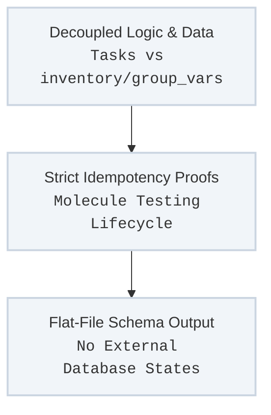

To ensure that the datacenter orchestration remains predictable, repeatable, and maintainable across long-term lifecycles, all playbook and role development must conform to strict structural programming standards.

By treating infrastructure code with the same rigor as compiled application software, the platform completely eliminates ad-hoc modifications, fragile shell-script loops, and opaque node states.

---

## Core Development Patterns

The framework enforces three primary software engineering concepts across the entire code repository:



### 1. Decoupling Execution Logic from State Data
Tasks and roles must operate as generic, abstract machines. No hardcoded hostnames, interface strings, IP assignments, or target configuration blocks are permitted inside a role's `tasks/main.yml`.
* **The Rules:** All variable states must reside cleanly inside the `inventory/` hierarchy or centralized `group_vars/` maps.
* **The DRY Objective:** If an internal IP or configuration parameter changes, an operator must mutate exactly **one** property in a variable file. The underlying task blocks dynamically parse that data matrix to scale the architecture automatically.

### 2. Strict Idempotency & Testing (Molecule Framework)
A role is considered incomplete and unsafe for production staging until it successfully passes a full execution validation cycle via the **Molecule** testing framework.
* **Verification Loop:** Molecule initializes a clean, local containerized instance (or local test VM), executes the role from scratch, checks for success, and then immediately runs a secondary execution pass.
* **The Gate:** The second execution pass must return an absolute `changed=0` status flag. If any task triggers a state change on an already configured machine, the pipeline fails the build, ensuring that configurations never cause unwanted churn on active hardware.

### 3. Flat-File Schema Constraints
To guarantee that the automation stack remains completely air-gap resilient and independent of moving parts, the platform rejects external database state engines for inventory and configuration history tracking.
* **Authoritative Text Source:** Everything tracking the environment state is modeled in human-readable, flat text structures (YAML or JSON).
* **Audit and Recovery Ease:** Because all parameters are saved as standard text assets, the configuration history can be read, searched, and recovered using simple Unix terminal utilities (`grep`, `awk`, `jq`) even during a complete catastrophic control-plane outage.

---

## Role File Structures

When generating new configuration collections or extending core roles, directory scaffolding must follow the standardized layout structure:

```text
roles/custom_feature/
├── defaults/
│   └── main.yml      # Lowest precedence overridable baseline variables
├── vars/
│   └── main.yml      # High-precedence role-locked system constants
├── tasks/
│   └── main.yml      # Deterministic, tag-driven operational blocks
├── templates/
│   └── config.j2     # Dynamic flat-file configuration templates
└── molecule/
    └── default/
        └── molecule.yml  # Scenario, driver, and validation definitions
```

---

## Continuous Integration Quality Gates

Before any pull request merges into the authoritative `main` branch of the `ansible-datacenter` repository, an automated validation workflow runs to enforce quality controls:

1. **Syntax & Lint Attestation:** Code blocks pass through `ansible-lint` to catch legacy formatting or non-standard configurations.
2. **Molecule Matrix Runs:** Every modified role executes its corresponding Molecule testing matrix against multiple OS targets (Ubuntu, CentOS, Rocky Linux).
3. **Flat Metadata Verification:** Validates that accompanying tracking tables and documentation references are compiled cleanly, ensuring the wiki stays synchronized with production states.
---
