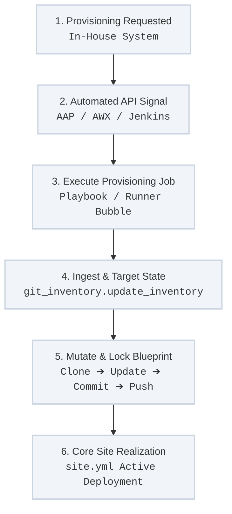

The platform maintains absolute alignment between live compute assets and your declarative code definitions by eliminating manual inventory adjustments. When a virtual machine or bare-metal host is spun up or decommissioned, the lifecycle event is programmatically committed to the Git-backed inventory repository via API integration patterns.

---

## Programmatic Provisioning & Git Loop

The host enrollment lifecycle transitions an initial provisioning request into a git-versioned inventory alignment loop without operator intervention:



---

## Architectural Lifecycle Steps

### 1. In-House Provisioning Request
An infrastructure scaling event or machine decommissioning request is initiated inside your internal, in-house provisioning system. This request carries key asset markers including IP addresses, hostnames, and targeted functional groups (such as GPU capabilities or specific application tags).

### 2. API-Driven Control Plane Handshake
The provisioning platform triggers a secure, non-interactive API callback to the central automation controller engine (such as Ansible Automation Platform/AAP, AWX, or Jenkins). This avoids manual GUI setup tasks and fat-fingered errors by converting the parameters directly into a standardized execution schema payload.

### 3. Execution of the Git Inventory Automation Loop
The automation controller triggers a dedicated maintenance job that executes the specialized **`dettonville.git_inventory.update_inventory`** module. This tool operates cleanly inside a containerized runner environment and automates the following steps:
* **Secure Clone & Pull:** Clones the authoritative repository containing your YAML inventories via protected SSH key channels.
* **Idempotent Modification:** Parses `inventory/{environment}/hosts.yml` or your central `xenv_groups.yml` matrices to inject or remove the host targets under their designated structural group mappings.
* **Git Commit & Push:** Signs the modification with an infrastructure tracking comment prefix (e.g., ticket ID) and pushes the verified state back up to your corporate source control repository.

### 4. Downstream Site Realization
Once the Git transaction is completed, the new host profile is permanently locked into code. Subsequent automated webhooks or active executions of your core `site.yml` ingest the fresh state configuration natively, instantly applying your foundational bootstrap rules (`bootstrap_ansible_user`, `bootstrap_linux`, etc.) to stabilize the machine.

---

## Domain Naming Conventions

When passing provisioning group inputs to the `update_inventory` module, targets must be mapped to their environment boundaries according to your strict naming standards:

* **Convention Schema:** Every domain boundary uses the `ca_domain_` prefix followed by the domain name in **reverse order with underscores replacing dots**.
* **Mapping Action:** For instance, if the provisioning engine spawns an asset bound for `dettonville.int`, the API payload instructs the module to map that host specifically inside the `ca_domain_int_dettonville` parent group layout.

---

## Automated Variable Mapping Example

This sample playbook task shows how the programmatic wrapper leverages the `update_inventory` module to enroll a newly generated GPU compute cluster node into your Git repository cleanly:

```yaml
- name: Automate host enrollment inside the Git inventory structure
  dettonville.git_inventory.update_inventory:
    inventory_repo_url: "ssh://git@git.local.dettonville.cloud:2222/infra/datacenter-inventory.git"
    inventory_file: "inventory/prod/hosts.yml"
    git_comment_prefix: "PROVISION-API-2026"
    ssh_params:
      key_file: "/run/secrets/automation_ssh_key"
    state: present
    host_list:
      - host_name: "inference-grid-03.dettonville.int"
        parent_groups:
          - ca_domain_int_dettonville
          - aibrix_prod
          - ollama_hosts
```

---

## Operational Verification Actions

### Review the Structural State of Your Inventory Graph Programmatically
```bash
ansible-inventory -i inventory/prod/hosts.yml --graph
```

### Validate Inventory Module Parameters and Documentation Locally
```bash
ansible-doc dettonville.git_inventory.update_inventory
```
---
