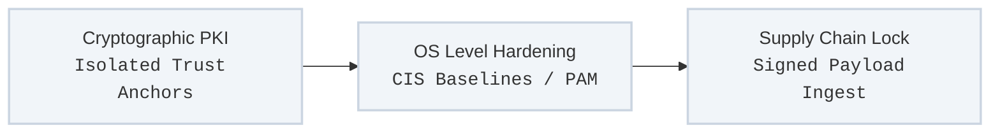

Operating infrastructure in private or regulated environments requires moving away from reactive security patches and public trust assumptions. The Dettonville framework integrates cryptographic verification and operating system hardening directly into its execution loop, treating security as an immutable system property rather than a post-provisioning checklist.

---

## Defensive Boundary Architecture

The framework operates under a zero-trust execution model inside your local network perimeter, structuring defensive layers into three clear operational vectors:

### 1. Cryptographic PKI & Local Trust Anchors
Without access to external public Certificate Authorities (CAs), the domain must maintain a self-contained, high-integrity cryptographic anchor.
* **Isolated Root Enforcement:** The framework generates and distributes local root and intermediate certificates deterministically across all node types.
* **Automated Local Minting:** System components utilize localized role hooks to mint, inject, and auto-renew transport layer security (TLS) assets for internal control-plane endpoints, eliminating expired certificate drift.
* **Strict Mutual TLS (mTLS):** Cross-node control communications require mutual certificate validation, denying rogue or unmapped nodes access to orchestration planes.

### 2. Operating System Hardening & Compliance Baselines
The framework natively translates Center for Internet Security (CIS) benchmarks into executable automation steps, applying them directly to core compute images during initial runtime hydration.
* **Kernel Parameter Hardening:** Restricts kernel runtimes by disabling unnecessary subsystems (e.g., legacy storage protocols, unprivileged user namespaces, IP forwarding limits).
* **Identity & Access Management:** Purges legacy protocol daemons, forces strict SSH configuration profiles (disabling password authentication and root access paths), and establishes immutable Pluggable Authentication Module (PAM) security rules.
* **Auditing and Logging Presets:** Locks down local file permission masks (`umask 027`) and hooks system logging facilities directly into local log collection fixtures from the first millisecond of runtime execution.

### 3. Software Supply-Chain Integrity
To eliminate vulnerability vectors associated with runtime package fetching, the framework controls the software supply chain through hermetic asset collection packaging.
* **Cryptographic Ingest Signatures:** Ansible collections, helper scripts, binaries, and dependencies are downloaded, audited, and locked into verified local archives before distribution to production nodes.
* **Immutable Dependency Freezing:** Dependencies are fully declared with strict SHA-256 hashes inside configuration source files. The framework fails fast if a file’s checksum deviates from the compiled declarative model.
* **Local Registry Custody:** Container images and operational tooling binaries are stored inside locally mirrored control-plane repositories, protected by local access roles and vulnerability scan loops.

---

## Enforcement Validation Cycle

Rather than relying on periodic external audits, security profiles are verified continuously during normal orchestration tasks:

1. **Pre-Flight Attestation:** Before changing local properties, tasks evaluate the system's active crypto and kernel profiles.
2. **Atomic Modification:** Updates are applied idempotently; if a configuration file is tampered with or modified manually, the framework rewrites it to match the authoritative source code state.
3. **Compliance Affirmation:** Execution logs output structured json states confirming system adherence to declared regulatory rules, providing continuous compliance readiness out of the box.
---
