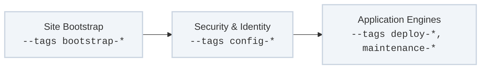

Site orchestration within the platform is entirely consolidated into a single authoritative master playbook: `site.yml`. In alignment with our strict **DRY (Don't Repeat Yourself)** baseline, rather than maintaining fragmented scripts per asset type, the entire local datacenter topology is driven through a unified, **tag-driven runtime execution framework**.



By pairing explicit target inventory groups with granular structural tags (`--tags`), engineers can selectively invoke isolated infrastructure tracks, execute targeted system bootstrapping, or audit compliance parameters without parsing separate logic loops.

---

## The Execution Order & "Always" Guardrails

The architecture of `site.yml` dictates a strict sequential compilation path. However, Ansible natively evaluates plays containing an `always` tag before descending into specific user-targeted tracks. The playbook capitalizes on this mechanic to establish foundational execution guardrails across all node families:

1. **`apply_ping_test` (`--tags always, ping-test`):** Performs a pre-flight ICMP and connectivity audit to map reachable host sets. Nodes failing this drop into a dynamically managed `discovered_host_offline` group to protect subsequent loops from hitting execution timeouts.
2. **`apply_common_groups` (`--tags always`):** Evaluates local inventory facts and programmatically compiles runtime group associations (such as sorting platforms into Linux variations or Windows pools) before running configurations.

*Note: For bootstrapping plays that handle the initial generation of orchestration machine credentials, these baseline checks will fail. These early-stage tasks require bypassing the automated guardrails by passing `--skip-tags always` during invocation.*

---

## Core Tag-Driven Operational Tracks

The master playbook categorizes datacenter lifecycle actions into strict operational tracks. This enables selective execution by mapping distinct tag clusters straight to specialized subsystem roles:

### 1. Baseline Bootstrapping (`--tags bootstrap-*`)
Stabilizes physical, virtual, and out-of-band compute assets into clean, operational states.
* **`bootstrap-linux`:** Configures basic operating system variables, filesystem partition mappings, local package paths, and network interface bonds.
* **`bootstrap-dell-idrac`:** Interacts with bare-metal out-of-band management interfaces via RACADM utilities to lock down underlying BIOS properties and hardware configuration templates.
* **`bootstrap-proxmox` / `bootstrap-esx`:** Provisions hypervisor layers, storage datastores, and binds private network fabrics.

### 2. Cryptographic Perimeter & Configuration (`--tags config-*`)
Establishes local trust boundaries, configures centralized identity systems, and hardens application parameters.
* **`bootstrap-ca-certs`:** Distributes and registers internal root and intermediate certificates deterministically across system trust anchors.
* **`config-dns` / `config-pki`:** Hydrates core control-plane fixtures by injecting flat-file host lookup tables and setting up local mutual TLS execution domains.
* **`config-tower` / `config-jenkins`:** Configures automated orchestration servers, schedules job matrices, and locks down execution credential stores.

### 3. Application Engines & Maintenance (`--tags deploy-*, maintenance-*`)
Controls active service runtimes, schedules software deployments, handles backup state management, and teardown operations.
* **`deploy-vm` / `deploy-app`:** Clones virtual machine images from secure templates, registers localized system instances, and triggers active application lifecycle plays.
* **`maintenance-os-upgrade`:** Orchestrates zero-downtime rolling updates, package security patching, and re-validates host states against the baseline profile.
* **`remove-tower-resources` / `export-tower-resources`:** Purges stale runner allocations or exports runtime environment parameters into portable text assets (YAML/JSON) for disaster recovery tracking.

---

## Recommended Execution Patterns

To run operations safely, commands must target explicit tags and limits straight from your engineering terminal:

### Execute Baseline Bootstrapping on a Specific Node
```bash
ansible-playbook -i inventory/hosts site.yml --tags "bootstrap-linux" --limit "vmhost01"
```

### Deploy a Virtual Machine Template Bypassing Pre-Flight Guardrails
```bash
ansible-playbook -i inventory/hosts site.yml --tags "deploy-vm" --skip-tags "always"
```

### List Tasks Matching a Hardening Track Without Applying Mutations
```bash
ansible-playbook -i inventory/hosts site.yml --tags "bootstrap-ca-certs" --list-tasks
```

---

## Next Steps

Explore the detailed parameter specifications, variable schemas, and role chains inside each primary track:

* **[Baseline Infrastructure Bootstrapping](/site-management/bootstrap/)** — iDRAC mechanics, network channel-bonding, and hypervisor storage provisioning.
* **[Control-Plane Configuration & Identity](/site-management/config/)** — Core DNS, local CA certificate distribution, and automation runner parameters.
* **[Deployment & Lifecycle Maintenance](/site-management/lifecycle/)** — Template scaling, resource extraction routines, and offline host reporting.
