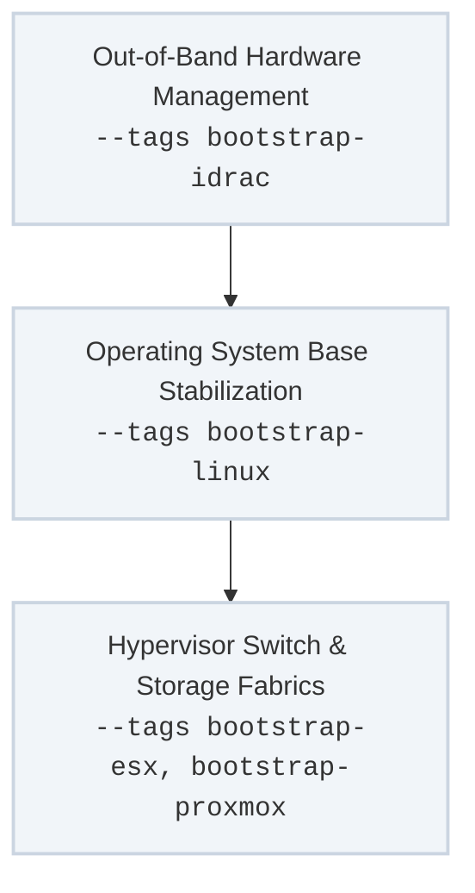

The **Baseline Bootstrapping** track governs the low-level lifecycle of the data center. It stabilizes raw physical chassis, injects operating system foundations, and constructs virtual hypervisor control boundaries.

Because this track establishes the initial connection vectors and credentials for untrusted or bare-metal assets, it serves as the prerequisite foundation for all downstream application runtimes.

---

## Technical Execution Flow

The bootstrap track progresses outward from bare hardware to virtual hypervisor layers:



---

## Role & Tag Mapping Matrix

### 1. Out-of-Band Hardware Control
* **Target Plays:** `Bootstrap Dell iDRAC Hosts`
* **Invocation Tags:** `bootstrap-idrac`, `bootstrap_dell_idrac`, `idrac`
* **Core Roles:** `bootstrap_dell_racadm_host`
* **Execution Mechanics:** Establishes out-of-band communication paths via Dell RACADM utility interfaces. This play configures baseline hardware properties, establishes localized RAID array boundaries, modifies low-level BIOS settings, and applies hardware-level network interfaces before an operating system is ever initialized.

### 2. Operating System Stabilization
* **Target Plays:** `Bootstrap Linux Operating Systems`
* **Invocation Tags:** `bootstrap-linux`, `bootstrap_linux`
* **Core Roles:** `bootstrap_linux`
* **Execution Mechanics:** Converts an unconfigured base OS install into a predictable engineering node. In alignment with our strict **DRY (Don't Repeat Yourself)** baseline, this singular role handles variations across Ubuntu, CentOS, Debian, and Rocky Linux by mapping parameters to discovered host facts.
    * Configures persistent network channel-bonding interface rules.
    * Maps multi-tiered storage disk volumes and applies optimized mounting flags.
    * Overrides package manager paths to target localized mirror systems.

### 3. Hypervisor Integration Profiles
* **Target Plays:** `Bootstrap ESX Hosts`, `Bootstrap Proxmox Hosts`
* **Invocation Tags:** `bootstrap-esx`, `bootstrap-proxmox`, `bootstrap_esx`, `bootstrap_proxmox`
* **Core Roles:** `bootstrap_esx`, `bootstrap_proxmox`
* **Execution Mechanics:** Sets up virtual compute fabrics. It provisions persistent storage datastores, binds isolated private switch ports, and prepares virtual node templating controllers to handle automated workload scaling.

---

## Operational Credential Bootstrapping

When provisioning fresh infrastructure components that do not yet possess your team's standard administrative keys or automation users, the implicit `always` pre-flight checks (`apply_ping_test`, `apply_common_groups`) will fail because they depend on pre-existing authentication states.

To bypass these safeguards and establish initial credentials, pass the explicit query skip flag:

```bash
ansible-playbook -i inventory/hosts site.yml \
  --tags "bootstrap-linux" \
  --limit "new_nodes" \
  --skip-tags always
```

Once this initial user and SSH keys are baked in via `--skip-tags always`, subsequent maintenance and compliance runs can be executed normally using standard tag-driven loops.
