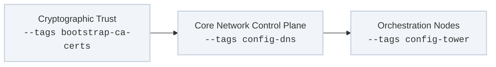

The **Control-Plane Configuration & Identity** track governs the configuration layer of the datacenter. Once a target host has been physically and structurally stabilized by the bootstrapping phase, this track injects the cryptographic profiles, local lookup tables, and management portals required to coordinate multi-node workflows.

---

## Technical Execution Flow

The configuration track establishes security anchors before hydrating platform connectivity and automation controllers:



---

## Role & Tag Mapping Matrix

### 1. Local CA Certification & Distribution
* **Target Plays:** `Bootstrap CA Certificates`
* **Invocation Tags:** `bootstrap-ca-certs`
* **Core Roles:** `bootstrap_ca_certs`
* **Execution Mechanics:** Distributes and registers internal corporate root and intermediate certificates deterministically across system trust anchors. It updates the operating system's central certificate store, allowing internal services to communicate over secure, verified mutual TLS (mTLS) channels without encountering untrusted authority alerts.

### 2. Core Network Control Plane
* **Target Plays:** `Configure Bind DNS Service`, `Configure Knot DNS Service`, `Configure PowerDNS Service`
* **Invocation Tags:** `config-dns`, `config-dns-bind`, `config-dns-knot`, `config-dns-powerdns`
* **Core Roles:** `bootstrap_bind_dns_host`, `bootstrap_knot_dns_host`, `bootstrap_powerdns_host`
* **Execution Mechanics:** Configures localized, high-availability authoritative name servers using open-source engines. In strict adherence to our **DRY (Don't Repeat Yourself)** baseline, identical zone definitions and forward/reverse address layouts are parsed dynamically from a single flat-file variable matrix and mapped across the varying structural syntaxes of Bind, Knot, or PowerDNS.

### 3. Orchestration & Platform Tooling
* **Target Plays:** `Configure Ansible Tower/AWX Resources`, `Configure Jenkins Server`
* **Invocation Tags:** `config-tower`, `config-awx`, `config-jenkins`
* **Core Roles:** `bootstrap_awx_resources`, `bootstrap_jenkins_host`
* **Execution Mechanics:** Configures the primary execution runners of the enterprise.
    * **Jenkins:** Restores plugins, provisions job templates, and maps local build worker environments.
    * **Ansible Tower / AWX:** Programmatically constructs organizational assets (inventories, credentials, job templates, and notification targets) directly through declarative code blocks, ensuring the runner environment itself is version-controlled.

---

## Strict DRY Configuration Paradigms

To avoid configuration drift across varying DNS backends or separate automation runner environments, all data matrices are completely decoupled from the execution code blocks.

For instance, changing an internal network domain IP pointer requires mutating exactly **one** record inside your inventory's global variables (`group_vars/all.yml`). The downstream plays automatically iterate through that flat schema to update Bind tables, refresh Jenkins worker paths, and push updated parameters to Tower endpoints in a single pass.

---

## Recommended Execution Control Loops

### Hydrate Local Core Domain Name Services
```bash
ansible-playbook -i inventory/hosts site.yml --tags "config-dns"
```

### Force Synchronize Ansible Tower Configuration States
```bash
ansible-playbook -i inventory/hosts site.yml --tags "config-tower"
```

### Distribute Updated Security Roots to a Specific Cluster Group

```bash
ansible-playbook -i inventory/hosts site.yml --tags "bootstrap-ca-certs" --limit "edge_compute"
```
