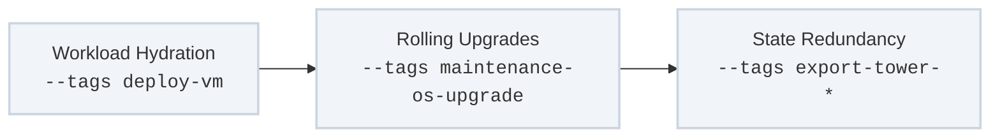

The **Deployment & Lifecycle Maintenance** track controls active workloads and runtime systems across the environment. Once physical structures are stabilized and control planes are fully initialized, this track handles the automated expansion, updating, and resource protection of application nodes.

---

## Technical Maintenance Flow

Workload provisioning and node optimization steps run through a predictable lifecycle path:



---

## Role & Tag Mapping Matrix

### 1. VM Deployment & Continuous Scaling
* **Target Plays:** `Deploy Virtual Machine Templates`
* **Invocation Tags:** `deploy-vm`, `deploy-app`
* **Core Roles:** Uses hypervisor-specific execution modules (vCenter/Proxmox APIs) combined with base configurations.
* **Execution Mechanics:** Clones golden OS templates across active server environments. This play automatically assigns virtual compute resources, maps fixed storage points, hooks up network boundaries, and runs initial system setups without human intervention.

### 2. Zero-Downtime Cluster Upgrades
* **Target Plays:** `Maintenance | OS Upgrade & Security Patching`
* **Invocation Tags:** `maintenance-os-upgrade`, `upgrade-packets`
* **Core Roles:** `maintenance_os_upgrade`
* **Execution Mechanics:** Safely handles kernel upgrades and package updates across production groups. It gracefully cordons active systems, drains workloads, executes localized package transactions, restarts instances when necessary, and verifies node health before returning them to active clusters.

### 3. Disaster Recovery State Extraction
* **Target Plays:** `Remove Tower Objects`, `Export Tower Objects`
* **Invocation Tags:** `remove-tower-resources`, `export-tower-resources`
* **Core Roles:** Uses automated API tasks via `awx.awx.export` integrations.
* **Execution Mechanics:** Protects configuration history. It programmatically extracts all runtime parameters, organizational structures, inventories, and credential references into a single flat text asset (YAML/JSON), keeping the configuration metadata safe from hardware failures.

---

## Recommended Execution Commands

### Deploy a New Application Instance from a Gold Template
```bash
ansible-playbook -i inventory/hosts site.yml --tags "deploy-vm" --limit "app_nodes"
```

### Run a Rolling Package Security Upgrade on the Compute Group
```bash
ansible-playbook -i inventory/hosts site.yml --tags "maintenance-os-upgrade" --limit "edge_compute"
```

### Export Ansible Tower Resource Parameters into Text Assets
```bash
ansible-playbook -i inventory/hosts site.yml --tags "export-tower-resources"
```
